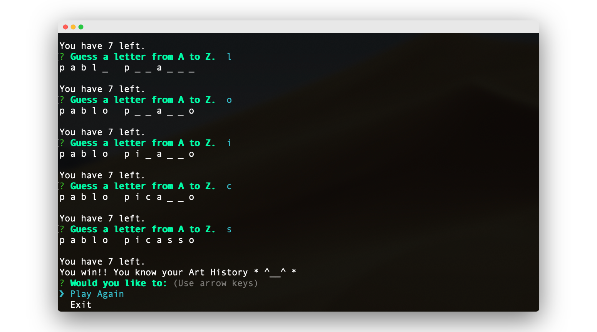
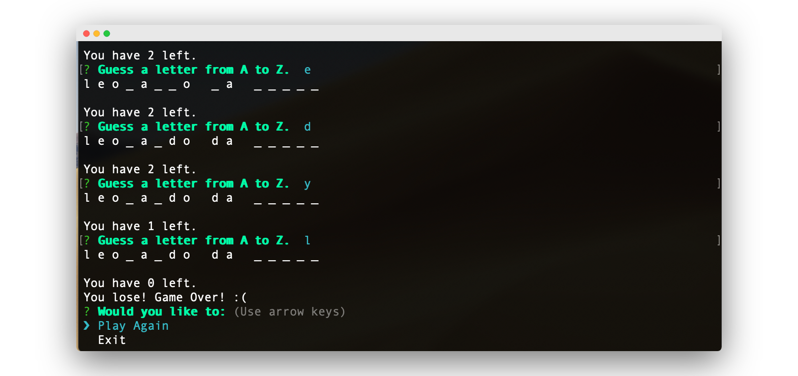

# constructor-word-guess

This assignment is an Advnaced Javascript assignment that is centered on building constructors using Npm Inquirer and Prompt. 

## How to Play
1. `git clone` the repo
2. `npm install`
3. Type in `node index.js`
4. Begin guessing a letter! 

I hope you know your Art History artists...

## Built With
* Node.js
* JavaScript
* JavaScript Object Constructors
* Npm packages: 
    * Inquirer 
    * Prompt
    * Chalk
