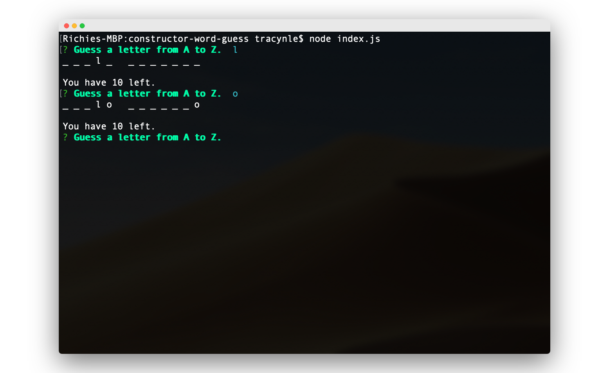

# constructor-word-guess

This assignment is an Advnaced Javascript assignment that is centered on building constructors using Npm Inquirer and Prompt. 

## How to Install
1. `git clone` the repo
2. `npm install`
3. Type in `node index.js`

## How to Play
Begin guessing a letter to the mystery word. You have 10 tries to guess. If you use all your tries, you lose and you have the option to start over or end the game.

I hope you know your Art History...
## Good Luck!

## Built With
* Node.js
* JavaScript
* JavaScript Object Constructors
* Npm packages: 
    * Inquirer 
    * Prompt
    * Chalk
